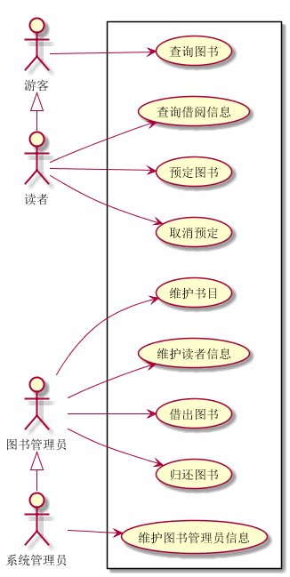
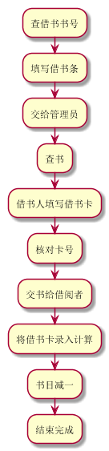
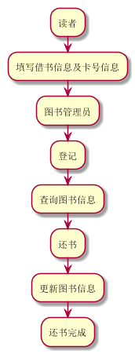

# 实验2：图书管理系统用例建模
|学号|班级|姓名|
|:-------:|:-------------: | :----------:|
|201510414116|软件(本)15-1|彭斌|

## 1. 图书管理系统的用例关系图
### 1.1 用例图PlantUML源码如下：
``` usecase
@startuml

left to right direction
skinparam packageStyle rectangle
actor 图书管理员
actor 读者
actor 游客
actor 系统管理员
rectangle  {
    :游客: --> (查询图书)
    :图书管理员: --> (借出图书)
    :图书管理员: --> (归还图书)
    :图书管理员: --> (维护书目)
    :图书管理员: --> (维护读者信息)
    :读者: --> (查询借阅信息)
    :读者: --> (预定图书)
    :读者: --> (取消预定)
    游客<|-读者
    :系统管理员:-->(维护图书管理员信息)
    图书管理员<|-系统管理员
}

@enduml
```

### 1.2. 用例图如下：


## 2. 参与者说明：

###     2.1 游客

主要职责是：可以查询图书管理系统中的图书信息
###     2.2 读者

主要职责是：拥有游客的功能，还具有订阅图书、查询节约情况和取消订阅等功能
###     2.3 图书管理员

主要职责是：管理读者信息、借出图书、归还图书和维护书目等都由其操作

###     2.4 系统管理员

主要职责是：具有图书管理员所具有的功能，还有增加删除图书管理员权限

##     3. 用例规约表

###     3.1 “借出图书”用例

|用例名称|借阅图书|
|:----------:|:---------:|
|参与者|借阅者和图书管理员|
|前置条件|图书管理员授权|
|后置条件|图书借出，书目减一|
|主事件流|1.管理员登录读者帐号；<br>2.录入借书信息<br>3.打印清单，交易完成|
|备选事件流|1.非法读者：系统提示错误并拒绝接受输入；<br>2.图书借完：系统提示错误并拒绝接受输入；|

**“借出图书”用例流程图源码如下：**
``` uc1_flow
@startuml
:查借书书号;
:填写借书条;
:交给管理员;
:查书;
:借书人填写借书卡;
:核对卡号;
:交书给借阅者;
:将借书卡录入计算;
:书目减一;
:结束完成;
@enduml
```
**“借出图书”用例流程图如下：**




###     3.2 “归还图书”用例

|用例名称|归还图书|
|:----------:|:---------:|
|参与者|借阅者和图书管理员|
|前置条件|图书管理员授权|
|后置条件|图书归还，书目加一|
|主事件流|1.管理员登录；<br>2.录入还书信息<br>3.更新书目，书目加一|
|备选事件流|非管理员：系统提示错误并拒绝接受输入；<br>|

**“借出图书”用例流程图源码如下：**
``` uc1_flow
@startuml
:读者;
:填写借书信息及卡号信息;
:图书管理员;
:登记;
:查询图书信息;
:还书;
:更新图书信息;
:还书完成;
@enduml
```
**“借出图书”用例流程图如下：**

