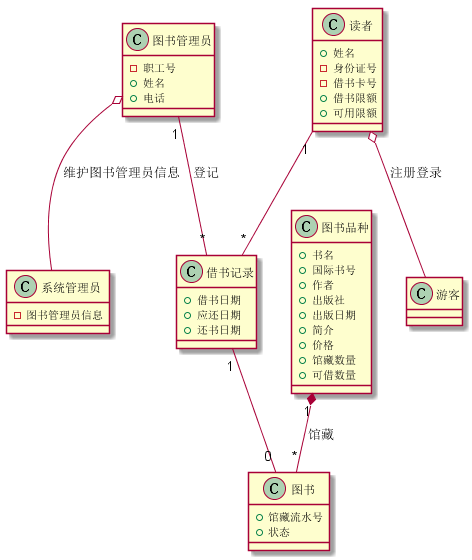
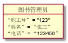
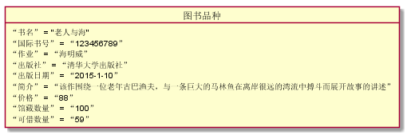
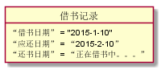

# 实验3：图书管理系统领域对象建模
|学号|班级|姓名|
|:-------:|:-------------: | :----------:|
|201510414116|软件(本)15-1|彭斌|

## 1. 图书管理系统的类图

### 1.1 类图PlantUML源码如下：

``` class
@startuml
图书管理员 o-- 系统管理员 :维护图书管理员信息
图书品种"1" *-- "*"图书 :馆藏
读者 o-- 游客 :注册登录
系统管理员 : -图书管理员信息
图书管理员"1" -- "*"借书记录 :登记
借书记录"1" -- "0"图书 
读者"1" -- "*"借书记录
class 图书管理员 {
    -职工号
    +姓名
    +电话
}
class 游客 {
    
}
class 读者 {
    +姓名
    -身份证号
    -借书卡号
    +借书限额
    +可用限额
}
class 图书 {
    +馆藏流水号
    +状态
}
class 图书品种 {
    +书名
    +国际书号
    +作者
    +出版社
    +出版日期
    +简介
    +价格
    +馆藏数量
    +可借数量
}
class 借书记录 {
    +借书日期
    +应还日期
    +还书日期
}


@enduml
```

### 1.2. 类图如下：



### 1.3. 类图说明：
1、由于此类图参照书上的，属性都是用的中文。
2、属性加上了由实验二中多了的 “游客” 和 “系统管理员”两条属性

## 2. 图书管理系统的对象图
### 2.1 类图书管理员的对象图
#### 源码如下：
``` class
@startuml
object 图书管理员 {
    “职工号” = "123"
    “姓名” = “张三”
    “电话” = “123456”
}
@enduml
``` 
图书管理员是有系统管理员授予的权限，用于管理图书管理系统
#### 对象图如下：


### 2.2 类读者的对象图
#### 源码如下：
``` class
@startuml
object 读者 {
    “姓名” = "李四"
    “身份证号” = “123456789”
    “借书卡号” = “12345678”
    “借书限额” = “50”
    “可用限额” = “15”
}
@enduml
``` 
读者是图书馆管理系统的使用者
#### 对象图如下：


### 2.3 类图书品种的对象图
#### 源码如下：
``` class
@startuml
object 图书品种 {
    “书名” = "老人与海"
    “国际书号” = “123456789”
    “作业” = “海明威”
    “出版社” = “清华大学出版社”
    “出版日期” = “2015-1-10”
    “简介” = “该作围绕一位老年古巴渔夫，与一条巨大的马林鱼在离岸很远的湾流中搏斗而展开故事的讲述”
    “价格” = “88”
    “馆藏数量” = “100”
    “可借数量” = “59”
}
@enduml
``` 
该类描述了图书的基本信息
#### 对象图如下：



### 2.4 类借书记录的对象图
#### 源码如下：
``` class
@startuml
object 借书记录 {
    “借书日期” = "2015-1-10"
    “应还日期” = “2015-2-10”
    “还书日期” = “正在借书中。。。”
}
@enduml
``` 
该类描述了图书馆使用者的情况
#### 对象图如下：
