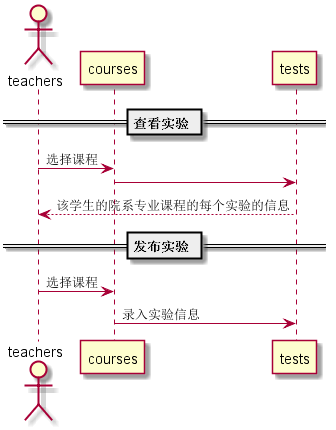

<!-- markdownlint-disable MD033-->
<!-- 禁止MD033类型的警告 https://www.npmjs.com/package/markdownlint -->

# “发布实验”用例 [返回](../README.md)

## 1. 用例规约

|用例名称|实验信息|
|-------|:-------------|
|功能|用于教师发布实验信息|
|参与者|老师|
|前置条件|必须是教师权限才能发布|
|后置条件||
|主事件流| |
|备选事件流||

## 2. 业务流程 [源码](../src/发布实验.puml)
 

## 3. 界面设计
- 界面参照: 
- API接口调用
    - 接口1：[courses](../接口/getcourses.md)
        用于获取课程信息
    - 接口2：[getoneTest](../接口/getoneTest.md)
        用于获取实验信息
    - 接口3：[setoneTest](../接口/setOneTest.md)
        用于发布一条实验信息

## 4. 算法描述

     无
     
## 5. 参照表

- [COURSES](../src/数据库设计.md/#COURSES)
