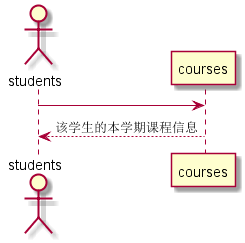

<!-- markdownlint-disable MD033-->
<!-- 禁止MD033类型的警告 https://www.npmjs.com/package/markdownlint -->

# “课程信息”用例 [返回](../README.md)
## 1. 用例规约

|用例名称|查看成绩|
|-------|:-------------|
|功能|学生查看自己本学期课程信息|
|参与者|学生|
|前置条件|学生需要先登录|
|后置条件| |
|主事件流| |
|备选事件流| |

## 2. 业务流程（顺序图） [源码](../src/sequence课程信息.puml)
 

## 3. 界面设计
- 界面参照: 
- API接口调用
    - 接口1：[getcourses](../接口/getcourses.md) 

## 4. 算法描述
    无
    
## 5. 参照表
- [TESTS](../src/数据库设计.md/#TESTS)
- [COURSES](../src/数据库设计.md/#COURSES)
